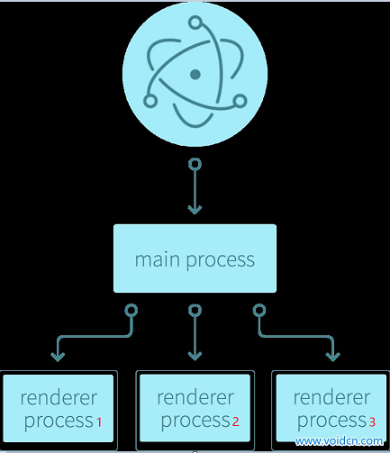
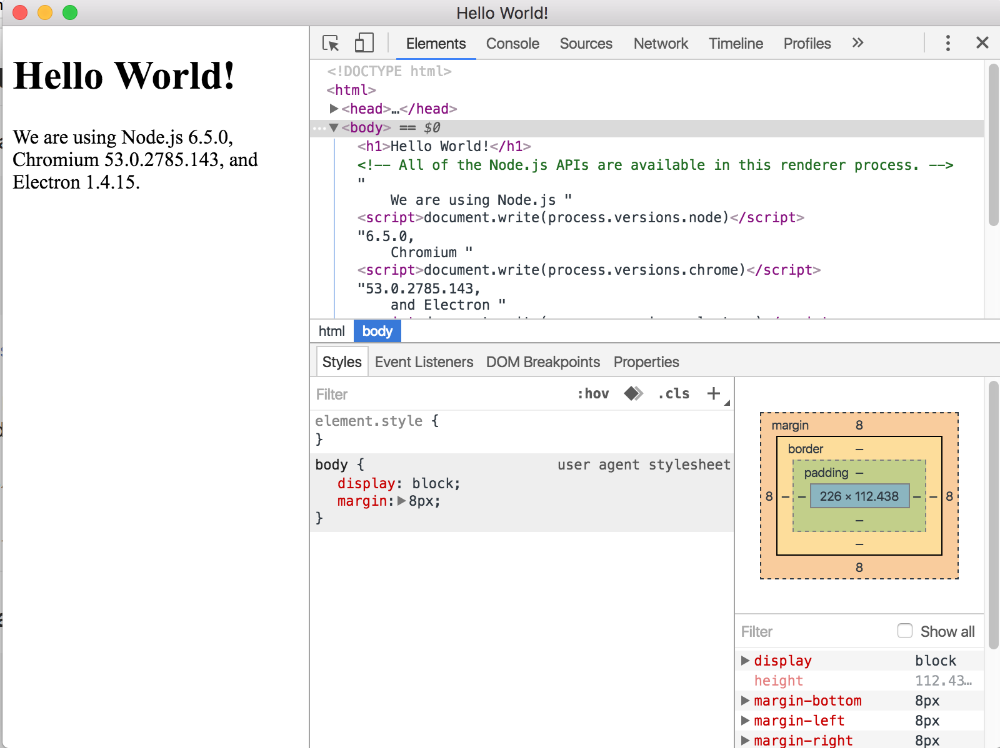
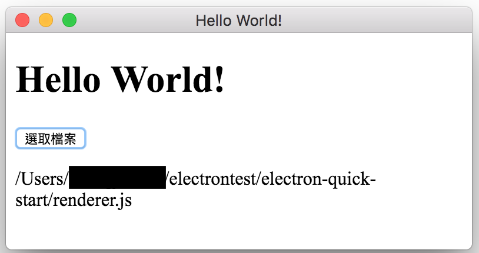

# Electron
* Electron簡介
* 開始第一個Electron－HelloWorld
* 簡單的應用練習
* Electron 發佈成可執行檔 APP 
* 延伸學習

---

# Electron簡介
Electron官方網站：http://electron.atom.io/

Electron 是一個由GitHub開發的開源框架，它允許使用Node.js和Chromium瀏覽器開發桌面GUI應用程式的開發工作。支援開發者使用 JavaScript 以及其它類似 HTML 和 CSS 的網頁技術來創建桌面應用程式，所做出來的程式可以在 Windows，Macintosh OS X 和 Linux 系統上執行。

它的出現讓使用 JavaScript 來寫桌面應用程式變為可能。Electron 可以視為修改過的瀏覽器，利用網頁技術來做為畫面的輸出，但同時又可以存取本機資源。如此一來，網頁和桌面應用程式就沒有任何差別，只要瀏覽器可以跑的地方程式幾乎都可以執行 (取決於是否用到特殊的 extension)。

## 什麼時候會考慮要用Electron？
想做桌面應用程式，又不會C++，又不會C#，又不會swing，也不會python等各大創建桌面窗體語言？
但是會HTML、CSS、Javascript...等技術。
Try it!!!

## 運行架構簡介
我們可以將 Electron 視為是修改過的 Chromium 瀏覽器提供 Node.js API (Chromium Content API)，讓我們可以寫 JavaScript 來控制視窗的行為。

他每開啟一個視窗，可以想像成開啟 Chrome 瀏覽器的一個 tab，一個 tab 是一個獨立的 process。每一個視窗都可以有自己的 WebKit，有自己的 DOM(Document Object Model, 文件物件模型)，執行自己的 JavaScript 來處理畫面。

一個應用程式可能會有很多個視窗，每個視窗都是獨立的 process，因此在 Electron 裡面，還會有一個幕後的 process 稱為 main process 來管理這些視窗 process，視窗 process 又叫做 renderer process。

# 開始第一個Electron－HelloWorld

## 佈署環境
本教程以Mac OS X為主。Electron支持的最低版本是 macOS 10.8。

如果是Windows要安裝的東西很多，詳細可以參考看看以下網址：
https://wizardforcel.gitbooks.io/electron-doc/content/development/build-instructions-windows.html
~~雖然我還沒try成功...~~  

首先要安裝node.js，可以開command line輸入"npm"看看有沒有東西出來，沒有就是要去裝；有的話最好確定是最新版比較安全。
node.js可以透過homebrew來安裝。還沒有安裝homebrew請參考以下網址：https://brew.sh/index_zh-tw.html
* 透過homebrew安裝Node.js

         $ brew install node

## electron-quick-start
command line先移到專案想放置的位置後，輸入下列指令會把code載進來並執行。

         $ git clone https://github.com/electron/electron-quick-start
         $ cd electron-quick-start
         $ npm install
         $ npm start

其中"npm install"指令會參考package.json去安裝這個app要執行時必要的依賴。一但執行完畢你便會發現多了"node_modules"資料夾。

更多訊息將在下一個段落做解釋。

## 結構分析
### package.json

         {
           "name": "electron-quick-start",
           "version": "1.0.0",
           "description": "A minimal Electron application",
           "main": "main.js",
           "scripts": {
             "start": "electron ."
           },
           "repository": "https://github.com/electron/electron-quick-start",
           "keywords": [
             "Electron",
             "quick",
             "start",
             "tutorial",
             "demo"
           ],
           "author": "GitHub",
           "license": "CC0-1.0",
           "devDependencies": {
             "electron": "^1.4.1"
           }
         }

應用名稱(name)、應用描述(description)、關鍵字(keywords)、版本號(version)...等比較直觀的項目就不多解釋了。

"main"定義了應用的入口文件。此例為"main.js"，也就是這個electron的main process。

"scripts"定義運行腳本命令的npm命令縮寫。此例中只定義"npm run start"會執行的腳本命令。

"devDependencies"和"dependencies"分別定義開發和運行時需要依賴的packages。本例只有前者，也就是electron本身。在執行"npm install"時便會依照這兩個資訊去安裝。在本教程後面要打包成Release可執行版本也是參考它們來包需要的東西。

如果開發過程才想到要安裝需要依賴的package，可以用以下命令來安裝：

         $ npm install <package name> --save
         $ npm install <package name> --save-dev

--save參數表示將該package寫入dependencies屬性，--save-dev表示將該package寫入devDependencies屬性。

如果想解除安裝，指令改成"uninstall"即可。package.json文件也會同步刪去資訊。

例如：此例的app如果想使用可以處理壓縮zip工作的archiver：

         $ npm install archiver --save

然後package.json文件便會多出敘述：

         "dependencies": {
             "archiver": "^1.3.0"
           }
           
### main.js

         const electron = require('electron')
         // app: 控制應用程式生命週期的模組
         const app = electron.app
         // BrowserWindow: 建立系統原生視窗 (native window) 的模組
         const BrowserWindow = electron.BrowserWindow

         const path = require('path')
         const url = require('url')

         // 保留一個全域的物件關聯以避免 JavaScript 物件 GC 機制造成視窗自動關閉
         let mainWindow

         function createWindow () {
           // 建立 browser window
           mainWindow = new BrowserWindow({width: 800, height: 600})

           // 載入 index.html 作為畫面
           mainWindow.loadURL(url.format({
             pathname: path.join(__dirname, 'index.html'),
             protocol: 'file:',
             slashes: true
           }))

           // 開啟開發者工具
           mainWindow.webContents.openDevTools()

           // 當 browser window 被關閉時，會送出 'closed' 訊號，並執行相關的 callback
           mainWindow.on('closed', function () {
             // 將此 window 物件解除關聯。
             // 如果你的應用程式支援多視窗，通常會將這些物件存在一個陣列裡面。
             // 現在就是刪除對應的視窗物件的時機。
             mainWindow = null
           })
         }

         // 當 Electron 完成初始化並且可以開始建立視窗的時候，
         // 會發送 'ready' 訊號，並執行對應的 callback
         // 我們指定收到 'ready' 訊號時，執行 createWindow()
         app.on('ready', createWindow)

         // 當所有視窗都關閉時，結束應用程式 ( app.quit() )
         app.on('window-all-closed', function () {
           // OS X 的使用習慣是當所有視窗關閉的時候，上方的 menu bar 仍然維持開啟
           // 此時應用程式還沒有完全關閉，除非使用者強制按 Cmd + Q
           if (process.platform !== 'darwin') {
             app.quit()
           }
         })

         app.on('activate', function () {
           // OS X 通常在應用程式已經起來了，但是所有視窗關閉的時候，還可以重新建立主視窗
           if (mainWindow === null) {
             createWindow()
           }
         })

上一段有提，就是electron的main process。
主要是控制窗口配置，如高度、寬度、入口頁面...等。

本例為只有打開一個視窗的進程，視窗的介面就是index.html。
有關各行程式碼的功能可以參考註解。

### index.html

         <!DOCTYPE html>
         <html>
           <head>
             <meta charset="UTF-8">
             <title>Hello World!</title>
           </head>
           <body>
             <h1>Hello World!</h1>
             <!-- All of the Node.js APIs are available in this renderer process. -->
             We are using Node.js ,
             Chromium ,
             and Electron .
           </body>

           
         </html>
         
視窗的介面就是網頁。也因為是網頁，所以CSS、Javascript...等其它可以支援瀏覽器的都可使用。
在架構上，網頁和網頁include的東西就是main process開啟的renderer process。

# 簡單的應用練習
## 開啟檔案dialog並顯示路徑
就直接拿上面的helloWorld來改吧。首先將index.html修改如下：

         <!DOCTYPE html>
         <html>
           <head>
             <meta charset="UTF-8">
             <title>Hello World!</title>
           </head>
           
           <body>
             <h1>Hello World!</h1>
             

               <button id="selectFile" onclick="selectFile();">選取檔案</button>
               

             

           </body>

         </html>

這裡include JS檔的方式我採用比較熟且常用的W3C方法；網路上找到的許多小例子也是採用這個方法。

再來撰寫renderer.js：

         var app = require('electron').remote; 
         var dialog = app.dialog;

         function selectFile () {
             dialog.showOpenDialog(function (fileNames) {
                  if(fileNames === undefined)
                           message.innerHTML = "沒有選擇任何檔案。";
                  else
                  {
                           message.innerHTML = fileNames;
                  }
             });
         }

這段程式碼使用remote的方式取用main process的dialog功能，有興趣可以參考末段"延伸學習"的連結。

執行npm start試試。

## 增加功能：開啟所選檔案
上面的應用只有顯示檔案路徑，node.js有很多package提供開啟檔案的方法，來實作吧。

在這裡使用opn這個package。使用前先去command line安裝它：

         $ npm install opn --save
         
然後在'renderer.js'加入它：

         var opn = require('opn');

最後在if-else裡面使用它：

       	opn(fileNames.toString());

這只是opn的基本用法：使用OS預設app開啟它。去npmjs可以找到更多的使用方法。

https://www.npmjs.com/package/opn

## 習作：加入archiver功能
在"HelloWorld"那一段有提到archiver這個package。
它算是npm中處理zip壓縮工作比較好用的package，
其中一項功能就是它可以一行code打包一整個資料夾。

https://www.npmjs.com/package/archiver

各位可以試著和dialog合用看看，寫出一個electron app會自動壓縮使用者選擇的檔案。

# Electron 發佈成可執行檔 APP 
兩個方法：一個是安裝Asar自己包，比較麻煩沒深入研究；另一個用官方提供的"electron-packager"。

         $ npm install electron-packager -g

這裡使用全域安裝的方式，如此一來就可以直接下command的方式執行它。

目前作業系統支援運行electron-packager的版本如下： 
* Windows (32/64 bit)
* OS X (also known as macOS)
* Linux (x86/x86_64)

目前支援打包的目標版本如下：
* Windows (also known as win32, for both 32/64 bit)
* OS X (also known as darwin) / Mac App Store (also known as mas)*
* Linux (for x86, x86_64, and armv7l architectures)

目前想要從非Windows平台開發後打包Windows Release版本，必須要額外安裝wine 1.6以上的版本(https://www.winehq.org/) 才能順利運行electron-packager。Mac OS X 可以透過Homebrew來安裝(大概要一小時以上)。

全部安裝完成後可以執行下面的指令試試：

         electron-packager . --all

它會將7種版本的Release檔包好在專案目錄上，當然一般不會這樣做。程式開發上就算是跨平台也會去各別優化，因為我們很難保證同樣的code放到不同OS上會不會出現問題。

         electron-packager <sourcedir> <appname> --platform=<platform> --arch=<arch> [optional flags...]

常用的參數如下，前兩個為必須：
* --platform：平台
* --arch：ia32, x64, all
* --version：electron 的版本。版本建議跟開發的 electron 的版本相同
* --icon：app 的 icon
* --asar：true or false 把 source 封裝，比較不容易被看到原始碼
* --ignore：忽略檔案，不要打包，建議把 electron 都忽略掉，因為打包後裡面就有了，可以減少檔案大小

還記得package.json的"scripts"嗎？可以把安裝指令寫進腳本。

         "scripts": {
             "start": "electron .",
             "build_mac": "electron-packager . MyApp --platform=darwin --arch=x64 --version=1.4.15 --icon=myapp.icns --asar=true --ignore=node_modules/electron-* ",
             "build_win32": "electron-packager . MyApp --platform=win32 --arch=x64 --version=1.4.15 --icon=myapp.ico --asar=true --ignore=node_modules/electron-* ",
             "build_linux": "electron-packager . MyApp --platform=linux --arch=x64 --version=1.4.15 --icon=myapp.png --asar=true --ignore=node_modules/electron-* "
         }
         
這樣就可以用簡短的指令去打包：

         $ npm run build_win32
         $ npm run build_mac
         $ npm run build_linux

最後提醒一點，electron-packager會將專案資料夾包成resource。所以打包前專案資料夾最好只有必要的東西，以免檔案過大。

# 延伸學習
* 官方資源 
  electron-api-demos：https://github.com/electron/electron-api-demos 
  electron-tutorial-app：https://github.com/crilleengvall/electron-tutorial-app 
* 其它資源 
  electron實作的一些小程式：https://github.com/hokein/electron-sample-apps 
* Processes之間溝通的兩者方法：remote & IPC 
  http://electron.atom.io/docs/api/remote/ 
  https://www.christianengvall.se/ipcmain-and-ipcrenderer/ 
* Node.js相關 
  Node.js：https://nodejs.org/api/fs.html 
  npmjs：https://www.npmjs.com/ 

